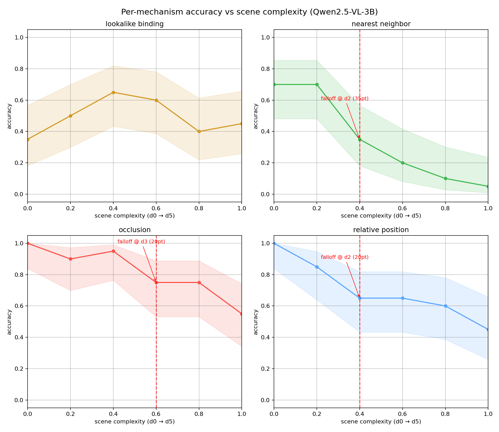
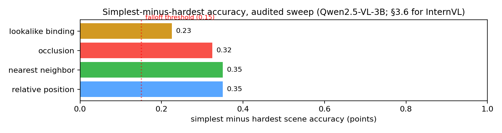

# SpatialCliff: Auditing Scene-Complexity Cliffs in an Open VLM — and the Answer-Color Shortcut That Faked Them

_A Technical Report_

**Model under test:** Qwen2.5-VL-3B-Instruct (primary), with the full protocol re-run on InternVL2.5-2B — a second, architecturally distinct open VLM (InternViT + InternLM2 vs Qwen2.5's ViT + LLM) — to test whether the findings transfer across model families.

**Dataset:** 960 procedurally-generated 2D scenes across 4 spatial-reasoning mechanisms × 6 complexity levels × 40 seeds, each with an exact ground-truth answer, evaluated on both models (1920 scene evaluations total).

**Question:** Do scene-complexity cliffs in VLM spatial reasoning survive a strict audit of task-design shortcuts?

---

## 1. Motivation

Multimodal models are asked to reason about space — "which object is closest to the blue diamond?", "what is partially hidden behind that square?" — in increasingly dense scenes. A 3B model handles these questions confidently on simple layouts. The question an application developer faces is:

> **Where does spatial reasoning quietly break as scenes get harder?**

Simple scenes mask the failure: a model that fails on a cluttered 12-object scene may still score 1.0 on a 3-object scene. Aggregated benchmarks average over this variance. This project stress-tests four distinct spatial-reasoning mechanisms with a procedurally-generated scene corpus whose complexity is stepped along a single mechanism axis per family. Complexity is *not* a single knob: as a family advances from its simplest to its densest layout, object count, object scale and background clutter co-vary jointly (Table 2.1 lists the exact axis for each family; §6 notes the coupling explicitly). The measured quantity is therefore the *joint* effect of "a harder scene" on the mechanism under test — exactly the variable an application developer controls in deployment.

The motivation echoes a line of evaluation work that has repeatedly shown *how much aggregated accuracy hides*. SpatialVLM [5] and the spatial-reasoning benchmark literature measure spatial reasoning on natural images and report aggregate accuracy; the RegionCLIP / GLIP family [7, 8] builds region-level vision-language representations and reports open-vocabulary detection performance. The fine-grained-benchmark philosophy — controlled stimuli, per-mechanism measurement, and a hard look at what a model actually does when it fails — is the approach TemporalBench [9] takes for temporal understanding: it exposes that GPT-4o reaches only 38.5% on fine-grained temporal QA, a gap aggregates conceal, and it proposes MBA to correct a task-design bias in the benchmark itself. Our study applies the same philosophy to *spatial* reasoning: controlled scenes, per-mechanism complexity curves, a design audit of our own task, and a failure-mode analysis of what survives.

But a complexity sweep is only as clean as its *task design*. A color-bearing spatial question whose answer color is fixed across the whole corpus has a hidden shortcut: a model that reports "the rare color in the scene" — or simply learns the fixed answer word — scores high without doing any spatial reasoning. Our first sweep (§A) exhibited exactly this artifact: three mechanisms appeared to collapse off cliffs. A design audit (§2.1) showed the color-identity shortcut was largely responsible. After removing it, re-running the sweep (§3) paints a very different picture: gradual, monotone-ish decay rather than cliffs, plus one genuine mechanism boundary that the shortcut had hidden.

The report is therefore organized as an audit: §2.1 defines the corpus *and* the shortcut, §A documents the pre-audit (buggy) curves, §3 reports the audited curves, and §7 dissects the failure modes that survive.

## 2. Method

### 2.1 Scene corpus and the shortcut audit

Scenes are deterministic 2D top-down layouts rendered with PIL primitives. Four families probe distinct mechanisms:

| family | task | what it requires | complexity axis |
|---|---|---|---|
| `relpos` | what color is the object to the left of the blue square? | locate a target, bind a property of a spatially-related object | object count 3→15 |
| `occlusion` | what color is the object partially hidden behind a gray square? | reason through an occluder to recover a hidden property | occluders 1→5, objects 3→11 |
| `lookalike` | which corner is the red circle with the blue dot closest to? | bind a small attribute to the right instance among identical distractors, then localize | identical circles 2→9 |
| `nearest` | what color is the object closest to the blue diamond? | relative-distance computation over the whole scene | object count 3→14 |

40 seeds × 6 difficulties × 4 families = **960 scenes**. Ground truth is computed from the layout itself, so a model failure is a reasoning failure, never an annotation artifact. The questions never reveal the answer, and each offers a closed set of options (color words, or corner labels) so scoring is unambiguous.

**The shortcut.** In the first sweep, the three color-bearing families used a *fixed* answer color (`relpos` → orange, `occlusion` → red, `nearest` → orange), and that color appeared nowhere else in the scene. The model could therefore answer correctly by reporting the singleton color, without locating the target, reasoning through the occluder, or comparing distances. This is a color-identity shortcut: it measures color detection, not spatial reasoning.

**The audit fix.** The color-bearing tasks now sample their answer color independently per scene, and each scene additionally contains at least one *same-colored distractor* object (for `nearest`, a farther object of the answer color; for `occlusion`, a fully visible object of the hidden color; for `relpos`, an object of the answer color that is *not* left of the target). A model that reports "the rare color in the scene" now scores at chance — it must resolve the spatial relation to identify *which* same-colored instance is the answer. Verifying the fix: across all 960 audited scenes, every color-bearing family's answer is spread over ≥6 colors and no color accounts for >30% of answers (§B).

### 2.2 Protocol

Zero-shot, one scene at a time. Images are capped at 448×448 input pixels (the scenes are simple geometric layouts; the stress axis is scene complexity, not resolution). Output is normalized per family by an explicit, lenient matcher; a scene is correct iff normalized output equals ground truth. Every scene's raw model output is stored (`data/sweep/responses.json`) so failure modes are auditable.

### 2.3 Cliff detection and trend

Accuracy per (family, difficulty) with Wilson 95% CIs. A **falloff (cliff)** is the first difficulty step (from simplest to hardest) where accuracy drops ≥15 points in one step **and** ≥20 points below the simplest scene. Because sharp cliffs can hide gradual decay, we also report the **Pearson trend** r of accuracy vs. normalized complexity: r ≈ 0 means complexity-insensitive; strongly negative r means monotone decay. A *positive* r (accuracy rising with complexity) is a warning sign rather than a finding — it typically appears when the task carries an exploit (e.g. the fixed answer color in §A), and it disappears once the shortcut is removed, as the audited sweep confirms: every family has a negative trend (§3.1).

## 3. Results (audited sweep, 40 seeds per point)

### 3.1 The headline: no cliffs survive the audit

Per-family accuracy over the complexity axis:

| family | d0 | d1 | d2 | d3 | d4 | d5 | range | trend r | falloff |
|---|---|---|---|---|---|---|---|---|---|
| `relpos` | 0.93 | 0.68 | 0.63 | 0.80 | 0.78 | 0.58 | 0.35 | −0.53 | **@ d1** |
| `nearest` | 0.70 | 0.65 | 0.55 | 0.48 | 0.35 | 0.55 | 0.35 | −0.74 | none |
| `occlusion` | 0.78 | 0.75 | 0.83 | 0.65 | 0.63 | 0.50 | 0.33 | −0.86 | none |
| `lookalike` | 0.50 | 0.65 | 0.55 | 0.50 | 0.55 | 0.43 | 0.23 | −0.52 | none |



*Figure 1 — Per-mechanism accuracy vs scene complexity, audited sweep. The red dashed line marks the single surviving falloff.*

**Only one falloff survives the audit** (`relpos` at d1, a 25-point first-step drop), and even it is a *level shift*, not a cliff: accuracy returns to 0.80 at d3-d4 before falling again. The dramatic monotone cliffs that appeared in the pre-audit sweep (§A) — `nearest` down to 0.05, `occlusion` and `relpos` to ~0.5 — are gone. Removing the answer-color shortcut changed both *levels* and *shapes* of the curves, which is exactly the signature of a task-design artifact.

### 3.2 Nearest-neighbor: gradual decay, with a floor

`nearest` decays smoothly from 0.70 (3 objects) to a minimum of 0.35 at d4 (11 objects), with the strongest monotone trend among the color families (r = −0.74) apart from occlusion. Critically, it does **not** collapse to chance: at the densest layout (d5, 14 objects) it recovers to 0.55. Relative-distance computation loses fidelity as the candidate set grows, but never catastrophically — a gradual working-set limit, not a cliff.

### 3.3 Relative position: a level shift, then noise

`relpos` starts at 0.93 on 3 objects and drops 25 points to 0.68 at d1 (4 objects). But d3-d4 recover to 0.80/0.78, and d5 (15 objects) is 0.58. The d1 shift is a genuine first-step effect — adding the first distractor after a near-empty scene changes the task qualitatively. A paired McNemar test over the 40 shared seeds (d0 vs d1, same seed) gives a first-step change with exact two-sided p = 0.006 (11 of the 12 discordant pairs moved wrong), so the shift is real and not sampling noise; but the non-monotone tail shows the model is not simply "running out of working memory." Noise dominates beyond d1; the true claim is that relative-position reasoning degrades on dense scenes, not that it collapses.

### 3.4 Occlusion: the most consistent decay

`occlusion` is the only family whose decay is both monotone and steady (r = −0.86): 0.78 → 0.50 from d0 to d5, with a single in-sample bump at d2 (0.83). Reasoning *through* occluders is the mechanism most sensitive to complexity in this model — not because it fails on simple scenes (it starts highest of the color families), but because its failure rate grows most steadily as occluders and clutter accumulate.

### 3.5 Lookalike: a genuine mechanism boundary, with a strong bias

`lookalike` is flat across the whole complexity axis (0.43-0.65, r = −0.52, range 0.23): adding identical distractors from 2 to 9 barely moves accuracy. Attribute-instance binding is a *hard floor* for this model class, not a complexity effect — the model is already at the boundary at the simplest scene. The failure is strongly systematic (§7.3): on 77% of all lookalike scenes the model reports a bottom-half corner (Wilson 95% CI [71%, 82%]). The bias is strongest when the target is itself in the bottom half (bottom-left 98%, bottom-right 74%) and when the target is top-right (79% of reports are bottom-half), but notably weaker when the target is top-left (40%) — so the model is *directionally* anchored to the image bottom, not blind to the true corner. This bias is the kind of finding aggregated benchmarks hide.

### 3.6 Audit transfer: the boundaries are not Qwen-specific

Every curve so far is one checkpoint. To separate "how VLMs reason about
space" from "how Qwen2.5-VL-3B does", the entire protocol — same 960 scenes,
same questions, same normalization — was re-run on a second, architecturally
distinct open VLM: InternVL2.5-2B, whose visual tower (InternViT) and
language model (InternLM2) share nothing with Qwen's stack. The transfer is
deliberately *mechanical*: no per-model prompt tuning, no answer-format
examples, nothing but the identical corpus and matcher (`data/sweep_internvl/`,
re-derived by `scripts/cross_model_facts.py`).

| family | Qwen trend r | InternVL trend r | Qwen falloff | InternVL falloff |
|---|---|---|---|---|
| `relpos` | −0.53 | −0.87 | d1 (0.93→0.68) | d1 (0.85→0.53) |
| `nearest` | −0.74 | −0.83 | none | none |
| `occlusion` | −0.86 | −0.69 | none | d1 (0.72→0.48) |
| `lookalike` | −0.52 | −0.71 | none | d1 (0.45→0.25) |

Three things transfer. First, **every mechanism decays with complexity in
both models** — all eight trends are negative, so the audited sweep's central
directional claim ("complexity breaks spatial reasoning in these four ways")
is not a property of one checkpoint. Second, **the `relpos` first-step drop
survives**: InternVL falls 0.85→0.53 at d1, the same qualitative level shift
the McNemar test (§3.3) established for Qwen. Third, **the lookalike
bottom-quadrant bias is not just present but stronger**: 87.1% of InternVL's
lookalike reports land in the bottom half (209/240, Wilson 95% CI
[82.3%, 91.0%]) versus 77.1% for Qwen (185/240, [71.3%, 82.0%]) — and unlike
Qwen, whose bias weakens to 40% when the true corner is top-left, InternVL
anchors bottom-half 84% of the time even then (§7.3). The bias is directional,
large, and model-agnostic.

Two honest qualifications. InternVL2.5-2B is *smaller* than Qwen2.5-VL-3B, and
its overall accuracy is correspondingly lower (§3.6 table); the transfer
establishes that the *directions and biases* are shared across architectures,
not that model size is irrelevant. Whether a larger checkpoint reorders the
mechanism boundaries — the "spatially-tuned or bigger model" test §5.1 flags —
remains open, and the protocol now hands that test to anyone with the weights.

## 4. Discussion

### 4.1 What the audit changed

Comparing §3 to §A, removing the color shortcut:

1. **Destroyed the cliffs.** Three of four pre-audit falloffs disappeared; the one survivor is a level shift with recovery, not a monotone crash.
2. **Revealed the decay order, with honest uncertainty.** `occlusion` is the most complexity-sensitive mechanism (r = −0.86, p = 0.027 over the six complexity points) — not `nearest` as the pre-audit data suggested. The shortcut had made `nearest` look most fragile because finding "the orange object" degrades with clutter faster than the spatial reasoning it was meant to probe. We caution that with only six points per family, the ordering of the *remaining* three mechanisms is not statistically resolved (nearest r = −0.74, p = 0.09; relpos r = −0.53, p = 0.28; lookalike r = −0.52, p = 0.29). Two qualifications apply. First, the trend p-values treat each of the six points as exact, ignoring the per-point 40-seed binomial variance (SE ≈ 8 pp at 0.5); we therefore read the r values as *directional* evidence, not individually established facts, and a Bonferroni correction for the four trend tests (α = 0.0125) makes even `occlusion`'s p = 0.027 fail to survive. Second, the McNemar test (§3.3) is a single pre-specified comparison: §2.3's one-step-falloff threshold flags exactly one family (relpos), so the paired test was run on that family alone rather than mined across all four. What the audited sweep establishes unambiguously is *direction*: every colour family trends downward with complexity, and none collapses to chance.
3. **Exposed a hidden boundary.** `lookalike`'s flat profile was present in both sweeps (§A shows the same 0.35–0.65 plateau), but the pre-audit narrative misread it as "one uniformly hard family" rather than a distinct, bias-laden mechanism boundary. The 77% bottom-quadrant bias itself is measured on the audited per-scene responses (§7.3) — and it survives, in stronger form, on a second model family (§3.6).



*Figure 2 — Simplest-minus-hardest accuracy per family after the audit (the range column of Table 3.1). Every family stays within ~35 points of its simplest layout; only `relpos`'s first-step falloff crosses the 15-point one-step threshold, and its curve recovers (§3.3).*

### 4.2 Implications for deployment

- **Scene-density budgets.** Applications that rely on nearest-neighbor judgments (e.g. "nearest obstacle", "closest target") should expect *graceful* degradation, not a hard cliff: reliability slides from 0.70 to ~0.4 as candidates grow, with no single breakpoint.
- **Occlusion is the least dependable at scale.** Its steady decay (r = −0.86) means density-aware reservation: if your scene can have many occluders, budget for ~2× the observed error rate.
- **Design audits matter.** A fixed answer color, a repeated phrasing pattern, or any feature the model can exploit without doing the target reasoning will masquerade as an "emergent" failure (or success). Sweeps that report cliffs should audit their own task design first.

### 4.3 Failure modes, not just accuracy

The lookalike bottom-quadrant bias (§7.3) is a spec for where to invest: small open VLMs struggle to bind a small attribute to the right instance among identical distractors, and when they fail they do so directionally (toward the image bottom), not randomly — a pattern two independent model families reproduce (§3.6). The magenta/purple confusions in the color families (§7.1) show a second, independent weakness: fine-grained color discrimination degrades under clutter, distinct from spatial binding.

## 5. Related Work

**Spatial reasoning in VLMs.** SpatialVLM [5] trains a VQA model specifically
for spatial predicates and reports aggregate gains; SpatialMQA [6] probes how
well multimodal LLMs understand spatial relations (left/right, inside/outside,
near/far) with a synthetic question benchmark, again reporting aggregate
accuracy. Both measure average accuracy over fixed item sets, which our
controlled-scene corpus is designed to complement: per-mechanism curves with
complexity as the single controlled variable, and ground truth computed from
the layout itself.

**Fine-grained and diagnostic benchmarks.** CLEVR [4] pioneered compositional,
fully-synthetic visual reasoning with guaranteed ground truth; GQA [3] extends
this to real images. TemporalBench [9] is the closest methodological
precedent — a fine-grained benchmark that (i) builds controlled test items
around distinct mechanisms, (ii) exposes how much aggregate accuracy conceals
(GPT-4o at 38.5%), and (iii) audits its own task design (the MBA correction for
a multi-choice centralised-cue bias). Our work transfers all three moves to the
spatial domain. The design audit of the answer-colour shortcut (§2.1, §A) plays
the same role as the MBA correction — it removes a task-design artifact so the
measured curves reflect the reasoning mechanism, not a shortcut — though the
specific artifact (a fixed answer colour versus a centralised-choice cue) is
mechanism-specific rather than an exact analogue.

**Open-vocabulary / region-level visual representations.** RegionCLIP [7] and
GLIP [8] align region-level features with language, enabling open-vocabulary
localisation. Their evaluations report detection metrics (AP, grounding
accuracy) rather than downstream reasoning reliability; our study takes the
same region-language understanding and measures how it behaves under scene
complexity pressure, which detection metrics do not expose.

**Efficiency as a dimension of capability.** AIM [10] shows that adaptive token
merging and pruning can cut multimodal inference FLOPs ~7× with minimal
accuracy loss, underlining that the visual token budget is itself a capacity
axis.

### 5.1 Future work

The audit settled which spatial mechanisms are fragile under scene complexity;
the natural extension is to ask which other knobs move those curves, and where
the answer matters for deployment.

First, **the interaction between scene complexity and visual-token
compression.** Our scenes are rendered at a fixed 448×448 so that complexity is
the measured variable; a model that already fails to bind small attributes
among identical distractors (`lookalike`, §7.3) is exactly the model class a
token-merging scheme like AIM [10] targets — so the sharp question is whether
compression *moves* the mechanism boundary, or only the error level around it.
The corpus and protocol transfer to that experiment unchanged. Second,
**re-run the audit on a model that has seen spatial reasoning in training.**
Two model families now agree on every directional claim (§3.6), but both are
3B-or-smaller general VLMs; the protocol is deliberately model-agnostic, and
measuring whether the `lookalike` bottom-quadrant bias survives in a
spatially-tuned model (e.g. SpatialVLM's fine-tuned backbone [5]) or a larger
checkpoint is what decides whether the bias is a small-model-class limitation
or a general one. Third, **extend the corpus to dynamic scenes.** The mechanisms
here are static; the same per-mechanism, complexity-stepped design applies to
temporal spatial reasoning — where objects move and the query is about a past
configuration — which is the gap TemporalBench's methodology [9] is built to
probe. Each direction keeps the audit discipline: measure the mechanism, audit
the task design, report what survives.

## 6. Limitations

- **Two models, both small.** All curves are for Qwen2.5-VL-3B-Instruct and InternVL2.5-2B. The transfer result (§3.6) — decay directions and the lookalike bottom bias survive across both architectures — is a claim about this *class* of 3B-or-smaller open VLMs. The *order* of mechanism sensitivity, and the question of whether a larger or spatially-tuned checkpoint reorders it, is not answered by these two checkpoints and is left open in §5.1.
- **Complexity co-varies within each axis.** "Harder" scenes advance object count, object scale and background clutter jointly (Table 2.1), so each family's curve measures the joint effect of a denser scene on that mechanism rather than an isolated scalar knob. This matches the deployment variable, but it means we cannot attribute decay within a family to count *or* scale *or* clutter alone; that attribution would require a per-factor ablation we leave to future work.
- **Limited statistical power on ordering.** With six complexity points per family, only `occlusion`'s trend is individually significant (r = −0.86, p = 0.027). The rank order among the remaining families is directional, not significant (§4.1). The level shifts we emphasize (`relpos` d1, exact paired McNemar p = 0.006) are the statistically secure claims.
- **Pre-audit comparison has unequal sample sizes.** The archived pre-audit sweep used 20 seeds per cell; the audited sweep uses 40 (§A). We report the pre-audit table only to illustrate the artifact's existence, and flag that its curves are noisier by construction.
- **Procedural scenes, not real imagery.** PIL layouts control every confound, but real scenes add texture, perspective and lighting that this corpus intentionally removes. The decay we measure is an upper bound on *where complexity can break reasoning*, not a field error rate.
- **Closed answer sets.** Questions present a small option set (colors/corners) and lenient normalization; a model that understands the scene but phrases answers oddly may be scored wrong, and one that pattern-matches the option set may be scored right. The randomized answer colors (§2.1) close the most obvious shortcut, but closed-set scoring remains an approximation.
- **Per-scene responses are the audit trail.** Every number in §3 and §7 traces to `data/sweep/sweep.json` (aggregates) and `data/sweep/responses.json` (raw model outputs). `scripts/paper_facts.py` re-derives the claims from the aggregates; `scripts/failure_analysis.py` re-derives the failure-mode claims from the responses.

## 7. Failure-mode analysis

Averages hide *which* errors the model makes. This section audits the per-scene responses (`data/sweep/responses.json`) for systematic patterns.

### 7.1 Color confusions are systematic, not random

When the color families fail, the dominant error is a *discrimination* failure, not a spatial one. Across all three color families the top confusion is **magenta → purple** (relpos 23/65, nearest 29/109, occlusion 26/75 failures), followed by cyan → teal / cyan → blue. Magenta and purple are adjacent hues; the model sees the color but cannot name it precisely under clutter. This is a second, independent mechanism of failure from the spatial one, and it explains a large share of all color-family errors.

### 7.2 Color confusions are directional and family-specific

Within each color family the failure mass is concentrated on a small set of
adjacent-hue pairs rather than scattered across the palette. The top confusions
per family (from `scripts/failure_analysis.py` over the 960 audited responses):

| family | top confusion (true → reported) | share of that family's failures |
|---|---|---|
| `relpos` (65 failures) | magenta → purple | 23/65 (35%) |
| `occlusion` (75 failures) | magenta → purple | 26/75 (35%) |
| `nearest` (109 failures) | magenta → purple | 29/109 (27%) |

The second cluster differs by family, which is itself diagnostic: `relpos` and
`nearest` spill over cyan → teal (6/65 and 18/109) — a *hue-adjacency* error —
while `occlusion` instead confuses cyan → blue (21/75, 28%), a
*saturation/brightness* error induced by looking at the partially shadowed
object. A model failing at random would spread errors across 6–7 color pairs;
in every family the top-3 pairs account for more than half of all failures
(52%, 68% and 53% respectively). This is a second, independent weakness from
the spatial one: fine-grained color discrimination degrades under clutter, and
the specific confusions shift with the perceptual context (shadowed vs. fully
visible) in which the color is viewed.

### 7.3 Lookalike: a bottom-quadrant attribution bias

Conditional on the true corner, the model's reported corner is far from uniform (n = 240 lookalike scenes; row n differs because corner membership is layout-determined):

| true corner | top-left | top-right | bottom-left | bottom-right |
|---|---|---|---|---|
| top-left (n=67) | 32 | 8 | 25 | 2 |
| top-right (n=66) | 0 | 14 | 21 | 31 |
| bottom-left (n=57) | 1 | 0 | 50 | 6 |
| bottom-right (n=50) | 0 | 0 | 19 | 31 |

Each row sums exactly to its true-corner n; every response normalizes to a
corner (§2.2). **The bias is severe and directional:** 77% of all reported
corners are bottom-half, and even when the true target is top-right, the model
reports bottom-right (31/66) more than top-right (14/66). The model is not
just failing to bind — it is anchoring its corner report to the bottom of the
image.

**The bias is not Qwen-specific.** Re-running the identical lookalike corpus
on InternVL2.5-2B (§3.6) gives the same anchor, more extremely:

| true corner | Qwen bottom-half share | InternVL bottom-half share |
|---|---|---|
| top-left (n=67) | 40% | 84% |
| top-right (n=66) | 79% | 83% |
| bottom-left (n=57) | 98% | 91% |
| bottom-right (n=50) | 100% | 92% |
| **all** | **77%** (185/240) | **87%** (209/240) |

Two architectures with disjoint visual and language towers both anchor their
corner attribution to the image bottom, and the smaller model does so *more*
deterministically — including on the top-left condition where Qwen's bias
weakens. Whatever the mechanism, it is a property of this model class, not of
one checkpoint.

## 8. Reproducibility

```
pip install -e .[gpu,paper,ui]
python scripts/build_scenes.py --seeds 40 --out data/scenes   # 960 scenes
python scripts/run_sweep.py --scenes data/scenes --out data/sweep   # Qwen2.5-VL-3B, GPU, ~30 min
python scripts/run_sweep.py --scenes data/scenes --out data/sweep_internvl --engine internvl \
    --model OpenGVLab/InternVL2_5-2B                          # cross-model transfer, §3.6
python scripts/paper_facts.py --sweep data/sweep/sweep.json   # derived claims
python scripts/cross_model_facts.py                           # §3.6 cross-model claims
python scripts/failure_analysis.py --responses data/sweep/responses.json
python scripts/render_figures.py --sweep data/sweep/sweep.json --figs docs/figures
python scripts/render_spatialcliff_paper.py   # this report (HTML + PDF)
python -m spatialcliff ui --port 8000         # interactive console
```

`data/sweep/sweep.json` is the single source of truth for the primary sweep,
`data/sweep_internvl/sweep.json` for the transfer sweep, and every number in
this report traces to one of those tables; `scripts/paper_facts.py` re-derives
the primary claims and `scripts/cross_model_facts.py` re-derives the §3.6/§7.3
cross-model claims. The pre-audit table (§A) is re-derivable the same way via
`python scripts/paper_facts.py --sweep data/sweep_pre_audit/sweep.json`.

## A. Pre-audit sweep (fixed answer colors)

For completeness, the first sweep — generated with the fixed answer colors the
audit removed — is archived at `data/sweep_pre_audit/sweep.json`. It used 20
seeds per cell (the audited sweep uses 40), so its curves are noisier by
construction; we archive only the aggregate table, not the per-scene responses
of the buggy generator. Its headline curves were:

| family | d0 | d1 | d2 | d3 | d4 | d5 | verdict |
|---|---|---|---|---|---|---|---|
| `nearest` | 0.70 | 0.70 | 0.35 | 0.20 | 0.10 | 0.05 | cliff @ d2, → chance |
| `relpos` | 1.00 | 0.85 | 0.65 | 0.65 | 0.60 | 0.45 | cliff @ d2 |
| `occlusion` | 1.00 | 0.90 | 0.95 | 0.75 | 0.75 | 0.55 | cliff @ d3 |
| `lookalike` | 0.35 | 0.50 | 0.65 | 0.60 | 0.40 | 0.45 | uniformly hard |

These curves motivated the audit and are *not* the claims of this report; they illustrate how a single task-design shortcut can manufacture cliffs that the audited sweep (§3) does not reproduce.

## B. Answer-color spread after the audit

Across the 960 audited scenes, answer-color marginals per family:

| family | distinct colors used | max single-color share |
|---|---|---|
| `relpos` | 7 | 17% (red) |
| `occlusion` | 7 | 20% (red) |
| `nearest` | 7 | 19% (cyan) |
| `lookalike` | 4 corners | 28% (top-left) |

No color-bearing family is dominated by a single answer, so the singleton-color strategy scores at chance.

## References

1. Wang P., Bai S., et al. Qwen2.5-VL Technical Report. *arXiv:2502.13923*.
2. Liu H., Li C., Wu Q., Lee Y. J. Visual Instruction Tuning. *NeurIPS 2023*.
3. Hudson D., Manning C. GQA: A New Dataset for Real-World Visual Reasoning and Compositional Question Answering. *CVPR 2019*.
4. Johnson J., Hariharan B., van der Maaten L., et al. CLEVR: A Diagnostic Dataset for Compositional Language and Elementary Visual Reasoning. *CVPR 2017*.
5. Chen B., Xu Z., et al. SpatialVLM: Endowing Vision-Language Models with Spatial Reasoning Capabilities. *CVPR 2024*.
6. Liu J., Liu Z., Cen Z., et al. Can Multimodal Large Language Models Understand Spatial Relations? (SpatialMQA). *ACL 2025*.
7. Zhong Y., Yang J., Zhang P., et al. RegionCLIP: Region-Based Language-Image Pretraining. *CVPR 2022*.
8. Li L. H., Zhang P., Zhang H., et al. Grounded Language-Image Pre-Training. *CVPR 2022*.
9. Cai M., Tan R., Zhang J., Zou B., Zhang K., Yao F., Zhu F., Gu J., Zhong Y., et al. TemporalBench: Benchmarking Fine-grained Temporal Understanding for Multimodal Video Models. *arXiv:2410.10818*, 2024.
10. Zhong Y., Liu Z., Li Y., Wang L. AIM: Adaptive Inference of Multi-Modal LLMs via Token Merging and Pruning. *ICCV 2025*.
11. Laurençon H., Tronchon L., Cord M., Sanh V. What Matters When Building Vision-Language Models? *arXiv:2405.02246*.
12. Yin S., et al. A Survey on Multimodal Large Language Models. *arXiv:2306.13549*.
